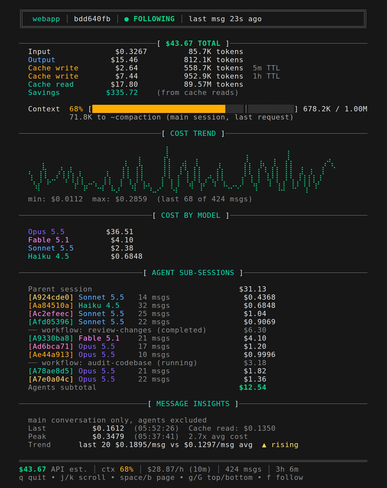
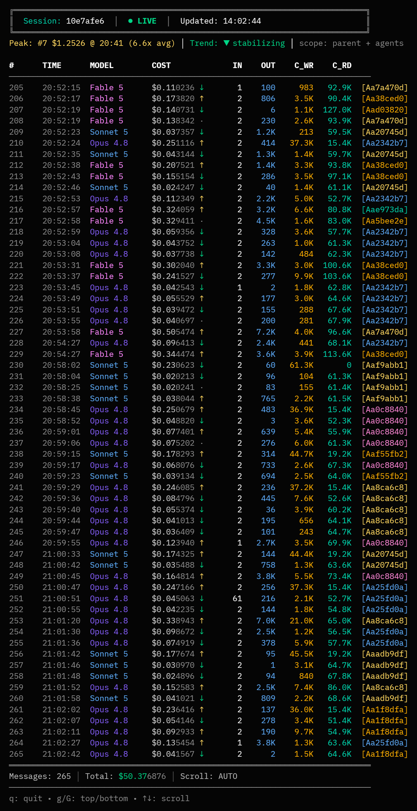

# ficha

Track your Claude Code API costs in real time.

## Screenshots



*`ficha watch` — live dashboard: session totals, cache economics, cost trend, per-model and agent sub-session costs.*



*`ficha breakdown` — scrollable per-message table: cost, token counts, and originating agent for every message, parent and agents interleaved chronologically.*

## Install

Prebuilt binaries for macOS, Linux (amd64/arm64), and Windows are on the [releases page](https://github.com/bardisty/ficha/releases) (checksums included).

Or build from source with Go:

```sh
go install github.com/bardisty/ficha@latest
```

## Usage

Run ficha from the same directory Claude Code is running in — it finds that project's sessions automatically:

```sh
cd /path/to/your/project
ficha          # view current session costs
ficha watch    # live monitoring (auto-follows new sessions)
```

To analyze a different project without cd'ing, pass its directory with `-p` / `--project`.

## Commands

| Command | Description |
| --- | --- |
| `ficha [show]` | Show latest (or specified) session costs |
| `ficha watch` | Live monitoring with auto-follow |
| `ficha breakdown` | Per-message cost table (scrollable) |
| `ficha list` | List all sessions |
| `ficha summary` | Total costs across all sessions |
| `ficha global` | Aggregated stats across ALL projects |
| `ficha version` | Print version information |

## Flags

| Flag | Description |
| --- | --- |
| `-f, --format <fmt>` | Output format: table, json, csv |
| `-p, --project <dir>` | Project directory (default: current dir) |
| `--project-dir <name>` | Claude project dir name (bypass auto-detect) |
| `-v, --verbose` | Show debug information |
| `--no-color` | Disable colored output |

Per-command flags:

| Command | Flag | Description |
| --- | --- | --- |
| `summary` | `-d, --details` | Add a per-session breakdown |
| `summary` | `--expand-agents` | Per-agent records (requires `--details`) |
| `global` | `-n, --top <n>` | Top N projects in table (default 10) |
| `global` | `--sort-by <key>` | Sort: cost, sessions, name, activity |
| `global` | `-d, --details` | All projects + cumulative column (table) |
| `show` | `--messages` | Per-message rows (json/csv only) |
| `show` | `-l, --live` | Live mode (`ficha watch` is an alias for `show --live`) |
| `show --live`, `watch`, `breakdown` | `--no-follow` | Disable auto-follow (pin to current session) |

## Examples

```sh
ficha show abc123             # view session by partial ID
ficha watch abc123            # watch specific session (pinned)
ficha -f json > out.json      # export to JSON
ficha summary -d -f csv       # per-session rows as CSV
ficha global --top 5          # top 5 projects by cost
ficha show -f csv --messages  # per-message rows as CSV
ficha list -p /path/to/dir    # list sessions for different project
```

## Machine output (json / csv)

`-f` only picks the encoding: json/csv always export the complete dataset as a single object / uniform-column table, safe for `jq` and pandas. Every input ficha could not read is counted, never swallowed (`skipped_sessions`, `skipped_agents`, `skipped_lines`, `estimated_cost_messages`), agent spend is always split out (`parent_cost + agents_cost = total_cost`), and `cost_by_model` keys are canonical model IDs, so summing by key needs no normalization.

The full export contract — flag interactions, record provenance, counters, per-message rows, csv safety — is in [docs/machine-output.md](docs/machine-output.md).

## How it works

Reads session files from `~/.claude/projects/` and calculates costs using Anthropic's pricing. Tracks prompt caching savings (cache reads cost 90% less than regular input tokens).

Agent sub-sessions are included: both regular subagents and Claude Code Workflow agents (grouped by workflow run, with the run's name and status from its metadata).
